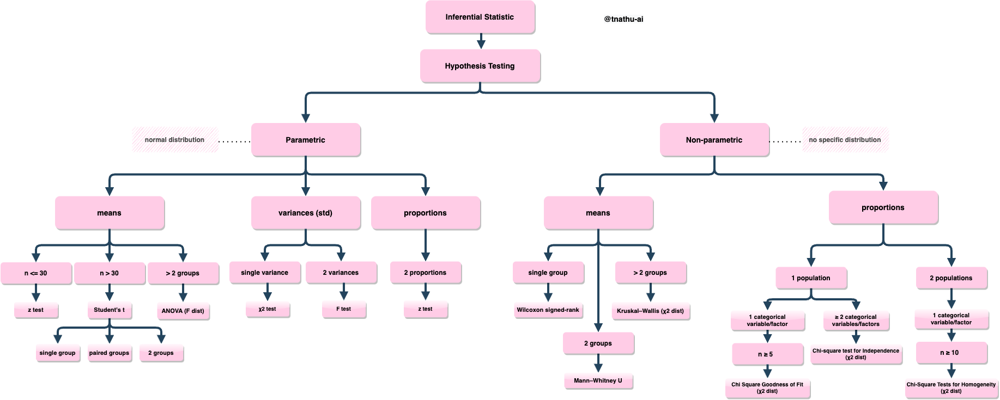

### A comprehensive guide to perform hypothesis tests and find confidence interval, degrees of freedom, critical value, test statistic

<a href="https://tnathu-ai.medium.com/parametric-and-non-parametric-tests-case-study-in-python-1b647c1df3af" target="blank">Read my Medium</a>

# Clean data
1. Inspect
2. Repair
3. Validate
4. Document

# Data analysis

# Visualization

• Comparison and distribution
    - Bar charts (several assorted variants)
    
• Changes over time
    - Line graphs
    - Area charts
    
• Correlation
    - Scatter plots
    - Heat maps
    
• Aggregation
    - Pie graphs
    - Tree maps
    
• Tabular
    - Pivot tables

# Hypothesis Testing step-by-step
+ Step-by-step process for conducting hypothesis tests: null hypothesis & alternative hypothesis
+ The importance of representative samples when performing hypothesis tests.
+ Statistical significance (alpha level α) and p-value
+ Calculate the confidence interval of a sample with 95% confidence (α = 0.05) that it is reflective of the true population.
+ The theory behind the central limit theorem and a clear example.
+ Test Statistic
+ Critical value
+ Conclusion

# Open Discussion

+ **Non-parametric hypothesis test has the assumption of a continuous and symmetric distribution's mean(median)?**

Regardless of The central limit theorem states that the distribution of sample means equal to or greater than 30 are often considered sufficient for the normal distribution. What if my distribution does not assume I am sampling from a particular distribution and is either continuous or symmetric about the mean (e.g. skewed distribution)? What type of hypothesis testing should I use?

+ **Multiple t-test?**

Performing multiple t-tests can increase the chance of making a Type I error, which is the incorrect rejection of a true null hypothesis. This is also known as a false positive result. The probability of making a Type I error increases with the number of tests performed. In this case, if you perform three t-tests (one for each pair of stores), the probability of making at least one Type I error is 0.143, or 14.3%, higher than the usual significance level of 0.05.

To address this issue, we can use a statistical test called ANOVA (analysis of variance), which compares the means of multiple groups simultaneously. ANOVA is more appropriate when you have multiple groups to compare, as it can help control for the overall probability of a Type I error. If the ANOVA result is significant, you can then perform post-hoc tests to determine which groups differ significantly from each other.

In summary, multiple t-tests can increase the chance of making a Type I error. To avoid this issue, we can use ANOVA to test for differences between multiple groups, followed by post-hoc tests to determine which groups differ significantly.

